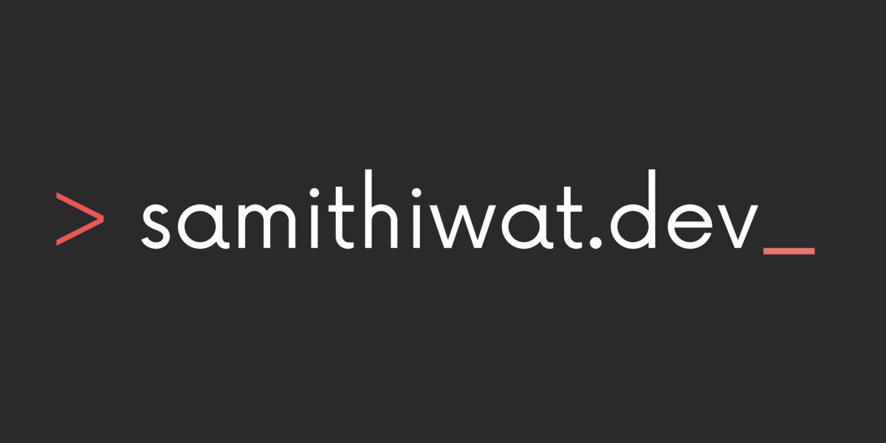

    

  
  
  
  
  
  

# Hi there 👋

Greetings, I'm Samithiwat Boonchai, a 2nd-year Computer Engineering student, at Chulalongkorn University.

I'm a backend and DevOps engineering, mostly backend stuff, ambitious software engineering. I love to collaborate with others. At this time I'm looking for a part-time job please contact me if you are interesting I hope experience and skill are exactly what you are looking for.

## Programming Languages

## Frontend Frameworks

## Backend Frameworks

## Devops Tools

## Github Stats

    
    
    
    

