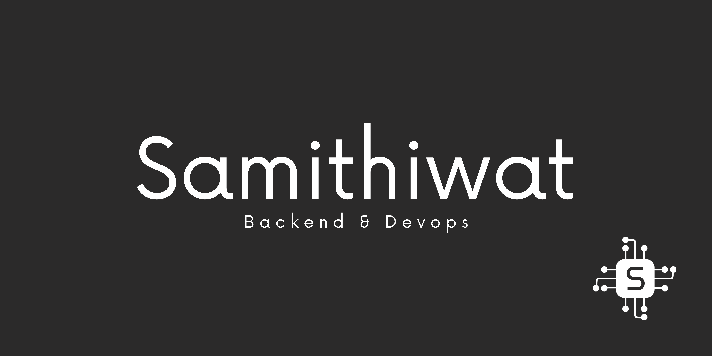

  
  
  
  
  

# Hi there 👋

Greetings, I'm Samithiwat Boonchai, a 2nd-year Computer Engineering student, Chulalongkorn University.

I'm a back-end and devops engineering, mostly backend stuff, ambitious in software engineering. I love to collabor with the others. At this time I'm looking for a part time job please contact me if you are interesting I hope experience and skill are exactly that your company looking for.

## Programming Languages

## Frontend Frameworks

## Backend Frameworks

## Devops Tools

## Github Stats

